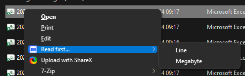

# What is "Read First"?

"Read First" is a simple Windows tool. It adds a new menu when you right-click any file in Explorer, called "Read first...".

When you use it, two choices show up:

- **Line**: Shows you just the first line of the file.
- **Megabyte**: Shows you up to the first 1 megabyte (MB) of the file.



When you click one of those, a window pops up with the content. You can read and copy the text, but not change it.


## Binary placeholder behavior

The renderer displays bytes as:

- Printable ASCII (`0x20` to `0x7E`) as characters.
- New lines and tabs as normal whitespace.
- Other bytes (including `0x00`) as placeholders like `<00>`, `<1F>`, `<FF>`.

## Install

Download the release zip, extract it, then run from PowerShell in the extracted folder:

```powershell
.\install.ps1
```

This will:

1. Copy the bundled `read-first.exe` to `%LOCALAPPDATA%\FirstReadMenu`.
2. Register context menu entries under `HKCU:\Software\Classes\*\shell`.

No administrator rights are required.
The installer does not require the Rust toolchain.

## Build

For local development:

```powershell
cargo build --release
```

## Uninstall

```powershell
.\uninstall.ps1
```

This removes:

- The two context menu entries.
- `%LOCALAPPDATA%\FirstReadMenu\read-first.exe` and optional sidecar files (if present).
